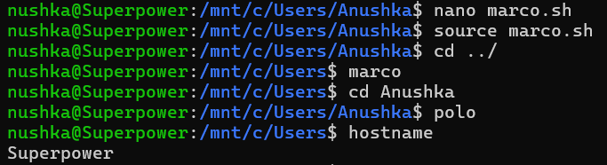
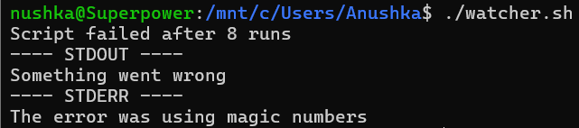

#   Shell Tools and Scripting

1.  `ls -alh --sort=time --color=auto`

2. 
``` bash
#!/bin/bash

# Function to save the current directory
marco() {
    export MARCO_DIR="$PWD"
}

# Function to return to the saved directory
polo() {
    cd "$MARCO_DIR" || echo "No directory saved. Run marco first."
}
```
Personal reference- <br>
`source filename.sh` - <br> 
Executes the commands in the given file in the current terminal<br>
Variables and functions defined in the script remain available after it runs<br>
`bash marco.sh` - <br>
It runs in a new temporary shell, and any functions or variables won’t persist after that script ends.<br>

`export` makes the variable available globally to the current shell and any child processes.<br>
`$VAR_NAME` means: "Get the value stored in the variable `VAR_NAME`




3. 
`failing_Script.sh`
```bash
#!/usr/bin/env bash

n=$(( RANDOM % 100 ))

if [[ n -eq 42 ]]; then
    echo "Something went wrong"
    >&2 echo "The error was using magic numbers"
    exit 1
fi

echo "Everything went according to plan"

```

`watcher.sh`
```bash
#!/bin/bash

count=0

while true; do
    ((count++))
    ./failing_script.sh > out.txt 2> err.txt
    if [[ $? -ne 0 ]]; then
        echo "Script failed after $count runs"
        echo "---- STDOUT ----"
        cat out.txt
        echo "---- STDERR ----"
        cat err.txt
        break
    fi
done
```
Personal reference- 
`(( ))` is used for arithmetic operations in Bash <br>
`n=$(( RANDOM % 100 ))` - Store a random number from 0–99 in variable n<br>
`exit 0` = success<br>
`exit 1` or any non-zero = error/failure<br>
`[] [[]]` - Difference

`chmod +x failing_script.sh`
`chmod +x watcher.sh`



4. 
`find . -name '*.html' -print0 | xargs -0 zip html_files.zip` <br>
`-print0` -  prints them separated by a null character (\0) instead of a newline, which is safe for filenames with spaces or special characters.

5. 
`find . -type f -printf '%T@ %p\n' | sort -nr`- Lists all files, from most recent to oldest.<br>
`find . -type f -printf '%T@ %p\n' | sort -n | tail -1` - Sorts from oldest to newest and gives the last(newest) file
