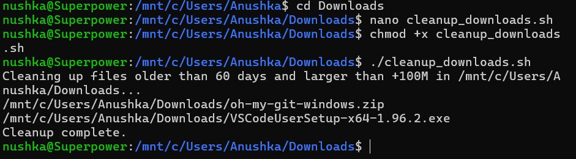

# Bash Script Automation Task: Clean Up Downloads Folder

`clean_downloads.sh`
```bash
#!/bin/bash

# Description:
# This script cleans up the Downloads folder by deleting files
# older than 2 months (~60 days).

DOWNLOAD_DIR="/mnt/c/Users/Anushka/Downloads"
DAYS=60
SIZE="+100M"

echo "Cleaning up files older than $DAYS days and larger than $SIZE in $DOWNLOAD_DIR..."

# Find and delete matching files
find "$DOWNLOAD_DIR" -type f -mtime +"$DAYS" -size "$SIZE" -print -delete

echo "Cleanup complete."
```

Make the file executable: `chmod +x cleanup_downloads.sh` <br>
Run the script: `./cleanup_downloads.sh`

## Justification 
This Bash script automates the cleanup of the Downloads folder by deleting files that are larger than 100 MB and older than 60 days. It is particularly useful for freeing up disk space by removing outdated and bulky files that are no longer needed.<br>
Two parameters `$DAYS` and `$SIZE` are defined at the top of the script, making it easy to modify the criteria as needed<br>
By scheduling this script to run periodically, users can maintain a cleaner and more efficient file system without manual intervention.

## Output

