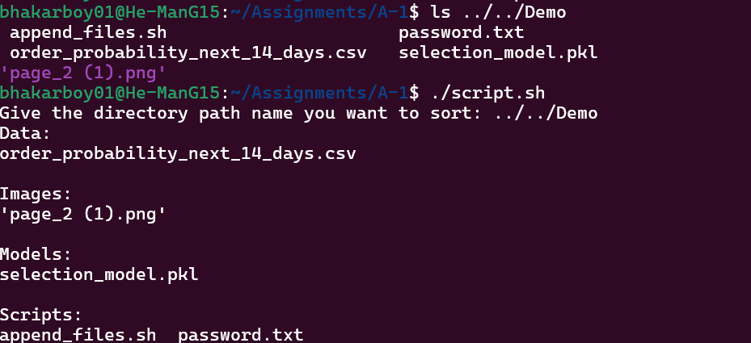

# Assignment-1 
## File Sorter
This is my submission for final boss assignment.

The script `script.sh` contains bash commands for grouping files based on there type and storing them in directories `Data`, `Images`, `Docs`, `Models`, `Scripts`.

When you run the `script.sh` it asks user for the address of directory of which the user wants to sort files for.

